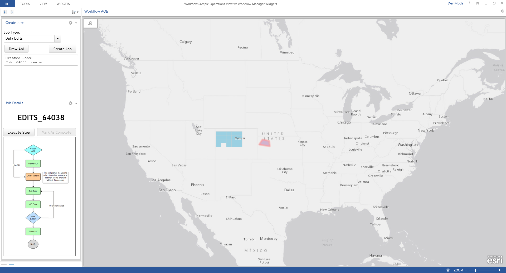

# Workflow Manager Dashboard Samples

This project contains 3 sample ArcGIS Workflow Manager Operations Dashboard widgets.

Reports Widget
--------------
This widget shows an overview of all of the jobs in the Workflow Manager system in pie chart form.
It also allows you to hover over sections of each section of the pie to view information about how many jobs are in that category.

Create Job Widget
-----------------
This widget allows you to create new jobs of any active Job Type, with an optional Area of Interest (AOI).

Job Workflow Widget
------------------
This widget allows you to select an AOI on the map and see the name and workflow of the selected job.
It also allows you to execute or mark steps as complete when allowed.

Using the Widgets
-----------------

1) Download the source code and save to a local folder or clone the repository
1) Edit the configuration options in config/settings.js.
1) Create a new ArcGIS Online Web Map which will be the basis of your operations view.
..* This Web Map should contain the AOI layer for the Workflow Manager view

1)  Either
[open Operations Dashboard in Dev Mode](https://developers.arcgis.com/javascript/jshelp/operations-dashboard-extensibility-test-debug.html)
or [deploy the widgets for use in Operations Dashboard](https://developers.arcgis.com/javascript/jshelp/operations-dashboard-extensibility-deploy-overview.html)
1) Create a new Operations View using the Web Map created earlier.
..* Turn on the option for the AOI layer to be selectable

1) Add the widgets to the Operations View
..* When adding the Job Workflow Widget, use the Selection of the AOI layer as the Data Source

Resources
---------

For more information, see the Workflow Manager JS API documentation at
<http://workflowsample.esri.com/doc/javascript/jsapi/index.html>
and the Operations Dashboard documentation at
<https://developers.arcgis.com/javascript/jshelp/operations-dashboard-extensibility-overview.html>
